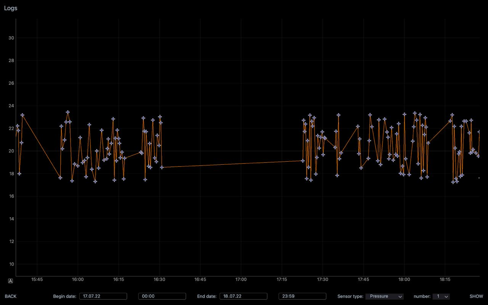

## Description

This is a redesigned Graphs Dashboard Logger to save, display and view data from 40 sensors.

Communication with the devices with sensors is done via serial by reading JSON messages.

Features:
- Save data to CSV files
- View logs by selecting date and time interval
- View immediate sensor values in digital form
- Display graphs with last values of all 40 sensors

Prerequisites: 
Python 3, PySide2, pyqtgraph, pyserial, pandas, numpy

## Screenshots

Stylesheet: amoled.qss by @gtronick